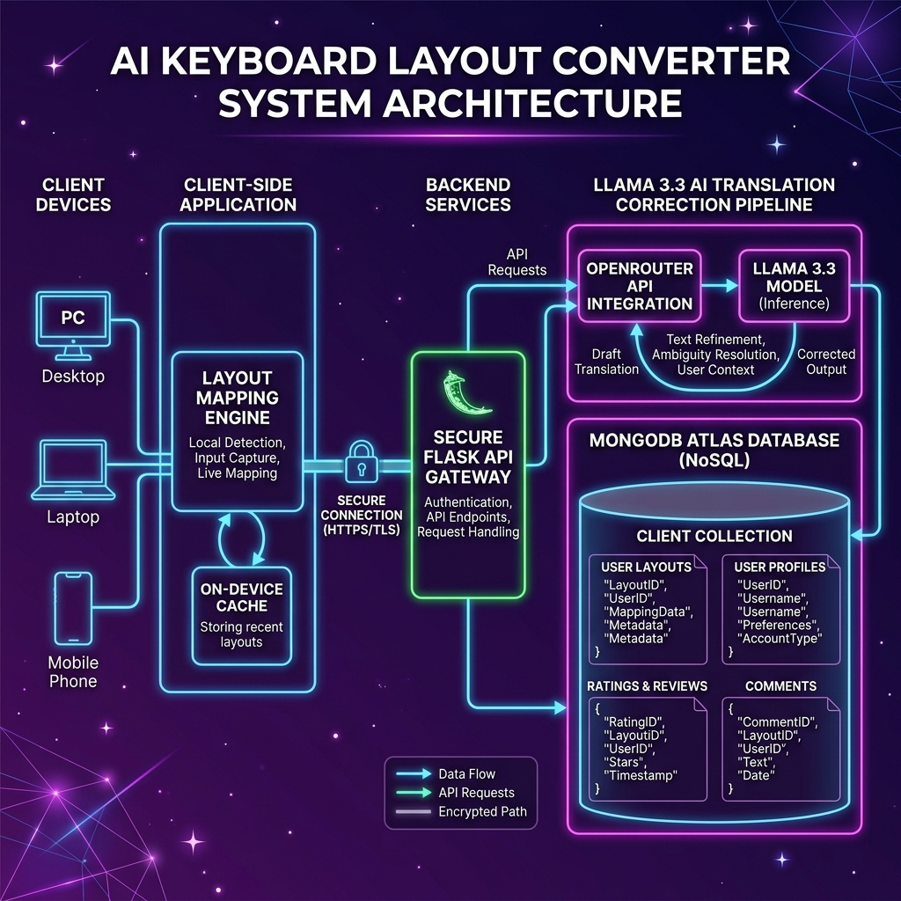

# 🌌 Smart Keyboard Converter AI

<p align="center">
  
</p>

<h3 align="center">Smart Keyboard Converter AI</h3>

<p align="center">
  A next-generation, Single Page Application (SPA) providing real-time, zero-latency conversion for text typed in the wrong keyboard layout. Super-premium dark cosmic design featuring custom user profiles, community layouts marketplace, interactive comments, and advanced AI-driven contextual grammar correction.
</p>

<p align="center">
  
  
  
  
  
</p>

---

## 📑 Table of Contents
1. [System Architecture](#-system-architecture)
2. [Key Capabilities](#-key-capabilities)
3. [Repository Directory Map](#-repository-directory-map)
4. [API Endpoints Reference](#-api-endpoints-reference)
5. [Security & Compliance Guardrails](#-security--compliance-guardrails)
6. [Local Installation & Setup](#-local-installation--setup)
7. [Docker & Containerized Deployments](#-docker--containerized-deployments)
8. [PM2 Production Process Operations](#-pm2-production-process-operations)
9. [Nginx Reverse Proxy Configuration](#-nginx-reverse-proxy-configuration)

---

## 🗺️ System Architecture

The application is structured around a fast client-side SPA conversion engine with secure API-driven server configurations, fallbacks, and database persistence.

<p align="center">
  
</p>

```mermaid
graph TD
    User([User Typist]) -->|1. Type Key Events| ClientSPA[Client Web App - SPA]
    
    subgraph Client-Side (Zero Latency)
        ClientSPA -->|2. Direct Offline Translation| JSConverter[converter.js Mapping Engine]
        JSConverter -->|3. Output Text Update| ClientSPA
    end

    subgraph Server-Side API Layer (Secure Verification)
        ClientSPA -->|4. AI Correction Request| FlaskApp[Flask API Gateway - app.py]
        FlaskApp -->|5. Verify JWT & CSRF| SecurityHeaders[Middleware & Auth Filters]
        SecurityHeaders -->|6. Query Profile & Settings| UsersDB[(MongoDB Users Collection)]
        
        SecurityHeaders -->|7. Forward Context| OpenRouter[OpenRouter API Gateway]
        OpenRouter -->|8. Fetch LLM Corrections| LlamaModel[Meta Llama 3.3 70B Model]
        
        LlamaModel -->|9. Corrected Text JSON| FlaskApp
        FlaskApp -->|10. Log Statistics| StatsDB[(MongoDB History Collection)]
        FlaskApp -->|11. Final Contextual Output| ClientSPA
    end
```

---

## ✨ Key Capabilities

### ⌨️ Conversions & Layout Customizer
* **Dual-Direction Conversion**: English LTR to Arabic RTL, and Arabic to English conversions.
* **Instant Client Mappings**: Layout translations happen in real-time on keypress without roundtrip latencies.
* **Layout Editor**: Import layout JSON files, export layouts, duplicate layout maps, and publish them.
* **AI-Assisted Processing**: Choice of 4 modes (Plain Layout translation, AI basic grammar check, AI translation with tone matching, AI context-aware translation).

### 🛍️ Layouts Marketplace
* **Search Engine**: Full text search over layouts with language filters.
* **Community Comments**: Add layout comments and feedback. Powered by a toggling expander button ("Show More Comments") to prevent scrolling clutter.
* **Interactive Star Ratings**: Submitting a rating dynamically recalculates the layout average and counts, updating all cards instantly.
* **Star Selection Hover Highlights**: Star elements highlight dynamically up to the hovered target and fade preceding ratings appropriately when not active.

### 🔐 Multi-Tier Security
* **Access Control**: Guest users can convert text, but publishing, favoriting, commenting, or exporting layouts requires a verified profile.
* **Double-Token Verification**: Protects backend states against CSRF using double-cookie token synchronization.
* **Memory Rate-Limits**: Rate-limits auth requests, registration attempts, and general API calls.

---

## 📁 Repository Directory Map

```
.
├── app.py                      # Flask Application Server Gateway
├── Dockerfile                  # Secure Non-Root Container Config
├── requirements.txt            # System Pip Requirements
├── docker-compose.yml          # Container Orchsetration Stack
├── nginx.conf                  # Nginx Reverse Proxy Config Template
├── configuration/              # Global Configurations
│   ├── config.py               # Env Validation & Config Parser
│   └── db.py                   # MongoDB Client & Text Indexes
├── middleware/                 # Interceptors & Filter Layers
│   └── security_headers.py     # CORS & Security Header Rules
├── models/                     # Schema Classes
│   └── schemas.py              # Pydantic Input Schemas
├── repositories/               # Persistent Data Access
│   ├── base.py                 # Abstract Base Repository CRUD
│   ├── layout_repository.py    # Layouts, Favorites, Ratings, Comments
│   ├── user_repository.py      # Users, Profiles, Preferences
│   └── history_repository.py   # Historical Conversion Stats
├── routes/                     # Blueprint API Endpoints
│   ├── auth.py                 # Account, Google OAuth, Profile Settings
│   ├── converter.py            # AI Conversions & Client Configs
│   ├── layouts.py              # User Layout Creator & Customizer
│   └── marketplace.py          # Marketplace Lists, Ratings, Comments
├── services/                   # Internal Core Business Logic
│   ├── auth_service.py         # OAuth Tokens & Revocation Tables
│   ├── converter_service.py    # Offline Text Layout Conversions
│   └── mail_service.py         # SMTP Verification & Reset Dispatcher
├── static/                     # SPA Client Assets
│   ├── favicon.png             # Logo Icon
│   ├── css/
│   │   └── style.css           # Premium Cosmic Glassmorphism Stylesheet
│   └── js/
│       ├── api.js              # Fetch client with Auto-CSRF header injection
│       ├── app.js              # SPA Router & Verification Hooks
│       ├── editor.js           # Key Mapper & Layout Editor
│       └── marketplace.js      # Marketplace Views & Ratings Interactions
└── templates/
    └── index.html              # Single Page Application HTML Template
```

---

## 📡 API Endpoints Reference

### 🔐 Authentication & Profile Blueprint (`/api/auth`)

| Method | Endpoint | Description | Payload/Params | Auth Required |
| :--- | :--- | :--- | :--- | :--- |
| `POST` | `/register` | Create account & send verification email | `UserRegisterSchema` | No |
| `POST` | `/login` | Authenticate credentials & set cookies | `UserLoginSchema` | No |
| `POST` | `/logout` | Revoke active refresh session & clear cookies | None | Yes |
| `POST` | `/refresh` | Exchange refresh cookie for new access cookie | None | Yes (Refresh) |
| `GET` | `/verify-email` | Verify email token | `?token=<token_str>` | No |
| `POST` | `/resend-verification` | Dispatch verification link to logged-in user | None | Yes |
| `POST` | `/reset-password/request` | Dispatch password reset link | `PasswordResetRequestSchema` | No |
| `POST` | `/reset-password/confirm` | Apply new password | `PasswordResetConfirmSchema` | No |
| `POST` | `/google` | Exchange Google OAuth code | `{"code": "auth_code"}` | No |
| `GET` | `/profile` | Retrieve profile metadata | None | Yes |
| `PUT` | `/profile` | Update profile information | `ProfileUpdateSchema` | Yes |
| `PUT` | `/ai-settings` | Update AI model preferences | `AIConverterSettingsSchema` | Yes |
| `GET` | `/stats` | Retrieve layout and conversion count stats | None | Yes |

### 🛠️ Layout Management Blueprint (`/api/layouts`)

| Method | Endpoint | Description | Payload/Params | Auth Required |
| :--- | :--- | :--- | :--- | :--- |
| `GET` | `/` | Fetch all user custom layouts | None | Yes |
| `POST` | `/` | Create a new custom layout mapping | `LayoutCreateSchema` | Yes |
| `GET` | `/<id>` | Fetch specific layout by ID | None | Yes |
| `PUT` | `/<id>` | Modify layout configurations | `LayoutUpdateSchema` | Yes |
| `DELETE`| `/<id>` | Delete layout, comments, and ratings | None | Yes |
| `POST` | `/<id>/duplicate`| Duplicate layout with a new name | `{"name": "New Name"}` | Yes |
| `POST` | `/<id>/publish` | Publish layout to the public marketplace | `{"tags": ["tag1"]}` | Yes (Verified) |
| `POST` | `/<id>/unpublish` | Remove layout from marketplace | None | Yes |
| `GET` | `/<id>/export` | Export layout config as JSON | None | Yes (Verified) |
| `POST` | `/import` | Import layout config JSON | `{"layout_json": {...}}` | Yes |

### 🛍️ Marketplace & Feedback Blueprint (`/api/marketplace`)

| Method | Endpoint | Description | Payload/Params | Auth Required |
| :--- | :--- | :--- | :--- | :--- |
| `GET` | `/` | Browse & search public layouts | `?q=search&language=Arabic&sort_by=likes` | Yes (Verified) |
| `GET` | `/<layout_id>` | Fetch single layout latest details & ratings | None | Yes (Verified) |
| `POST` | `/<layout_id>/favorite`| Toggle favorite status | None | Yes |
| `POST` | `/<layout_id>/download`| Increment layout download count | None | No |
| `GET` | `/<layout_id>/comments`| Fetch comments list | None | No |
| `POST` | `/<layout_id>/comments`| Post layout feedback comment | `CommentCreateSchema` | Yes (Verified) |
| `DELETE`| `/comments/<id>` | Delete comment | None | Yes |
| `POST` | `/<layout_id>/rate` | Submit review rating score (1-5 stars) | `RatingCreateSchema` | Yes (Verified) |
| `GET` | `/<layout_id>/my-rating`| Fetch user rating for layout | None | Yes |
| `GET` | `/favorites` | Fetch user favorite layouts | None | Yes |

---

## 🛡️ Security & Compliance Guardrails

* **CSRF Mitigation**: Double Cookie Submission. The frontend client reads a `csrf_access_token` from a cookie and must send it in the `X-CSRF-Token` header. Flask-JWT-Extended validates this match for all state-changing operations.
* **NoSQL Injection Block**: Prevented by utilizing Pydantic schemas to validate input data types and parsing custom MongoDB text index configurations with `language_override="none"`.
* **Verified Verification Chain**: Checks user verified status on the backend before allowing layouts publication, exporting configurations, commenting, or rating.
* **Secure Cookie Attributes**: Standard authentication cookies are set to `HttpOnly`, `SameSite=Lax`, and `Secure` (in production) to prevent access by malicious browser extensions.

---

## 🛠️ Local Installation & Setup

1. **Clone project & install dependencies**:
   ```bash
   git clone https://github.com/AladdinAlynaey/keyboard-converter.git
   cd keyboard-converter
   python3 -m venv .venv
   source .venv/bin/activate
   pip install -r requirements.txt
   ```

2. **Configure environment settings**:
   Create a `.env` file inside the root directory:
   ```env
   FLASK_ENV=development
   FLASK_SECRET_KEY=enter-a-highly-secure-key-phrase
   MONGO_URI=mongodb://127.0.0.1:27017/
   MONGO_DB=keyboard_converter
   JWT_SECRET_KEY=jwt-secret-signing-key

   # SMTP Setup
   SMTP_HOST=smtp.gmail.com
   SMTP_PORT=587
   SMTP_USERNAME=your-email@gmail.com
   SMTP_PASSWORD=your-gmail-app-password
   SMTP_FROM_EMAIL=your-email@gmail.com
   SMTP_FROM_NAME="Keyboard Converter"

   # OpenRouter AI Setup
   AI_ENABLED=True
   OPENROUTER_API_KEY=your-openrouter-token-here
   DEFAULT_AI_MODEL=meta-llama/llama-3.3-70b-instruct:free

   # Google Client Credentials
   GOOGLE_CLIENT_ID=your-google-oauth-client-id
   GOOGLE_CLIENT_SECRET=your-google-oauth-client-secret
   GOOGLE_REDIRECT_URI=https://keboard.alaadin-alynaey.site/auth/google/callback
   ```

3. **Start the local server**:
   ```bash
   python3 app.py
   ```
   The application will listen on [http://127.0.0.1:5454](http://127.0.0.1:5454).

---

## 🐳 Docker & Containerized Deployments

The Docker image uses a multi-layered build and drops privileges to a non-root user (`appuser` with ID `10001`) during container start-up.

* **Build the image**:
  ```bash
  docker build -t keyboard-converter .
  ```
* **Run container (isolated)**:
  ```bash
  docker run -d --name keyboard-app -p 5454:5454 --env-file .env keyboard-converter
  ```
* **Orchestrate via docker-compose**:
  ```bash
  docker-compose up -d
  ```

---

## ⚙️ PM2 Production Process Operations

PM2 manages and monitors the application processes in production environments.

* **Register and Start Process**:
  ```bash
  pm2 start app.py --name keyboard-converter --interpreter .venv/bin/python3
  ```
* **Monitor Logs (real-time)**:
  ```bash
  pm2 logs keyboard-converter
  ```
* **Restart & Update Env Settings**:
  ```bash
  pm2 restart keyboard-converter --update-env
  ```
* **Stop Process**:
  ```bash
  pm2 stop keyboard-converter
  ```

---

## 🌐 Nginx Reverse Proxy Configuration

To serve the application securely over HTTPS (with auto-renewal of Let's Encrypt certificates), configure an Nginx virtual host proxy block:

```nginx
server {
    listen 80;
    server_name keboard.alaadin-alynaey.site;

    # Redirect all HTTP requests to HTTPS
    return 301 https://$host$request_uri;
}

server {
    listen 443 ssl http2;
    server_name keboard.alaadin-alynaey.site;

    ssl_certificate /etc/letsencrypt/live/keboard.alaadin-alynaey.site/fullchain.pem;
    ssl_certificate_key /etc/letsencrypt/live/keboard.alaadin-alynaey.site/privkey.pem;
    include /etc/letsencrypt/options-ssl-nginx.conf;
    ssl_dhparam /etc/letsencrypt/ssl-dhparams.pem;

    # Set up client max upload limits
    client_max_body_size 10M;

    # Serve Nginx Logs
    access_log /var/log/nginx/keyboard_access.log;
    error_log /var/log/nginx/keyboard_error.log;

    location / {
        proxy_pass http://127.0.0.1:5454;
        proxy_http_version 1.1;
        proxy_set_header Upgrade $http_upgrade;
        proxy_set_header Connection 'upgrade';
        proxy_set_header Host $host;
        proxy_cache_bypass $http_upgrade;
        
        # Security Header forwards
        proxy_set_header X-Real-IP $remote_addr;
        proxy_set_header X-Forwarded-For $proxy_add_x_forwarded_for;
        proxy_set_header X-Forwarded-Proto $scheme;
    }
}
```
